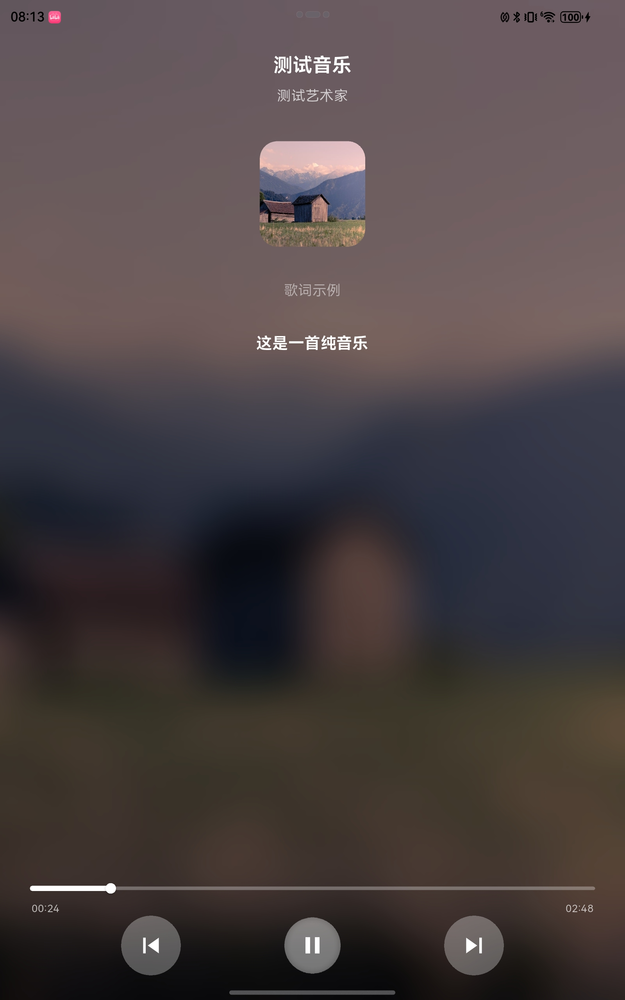
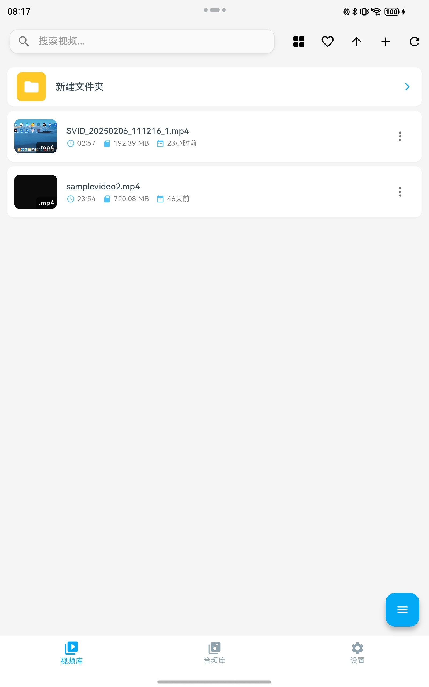
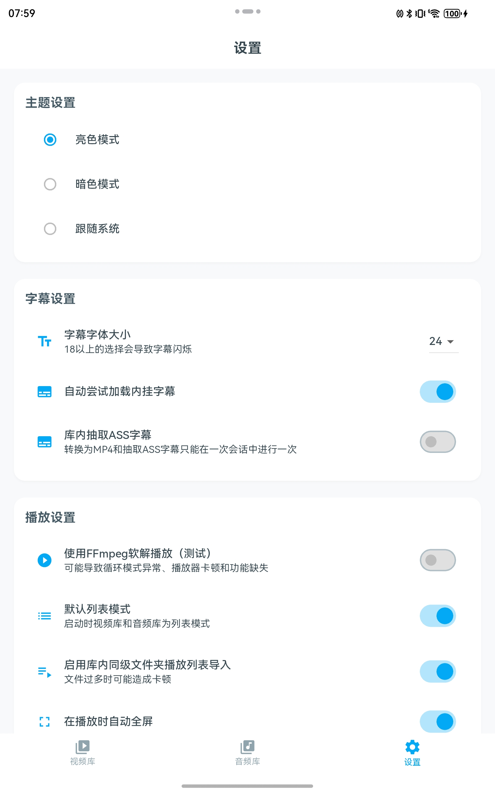
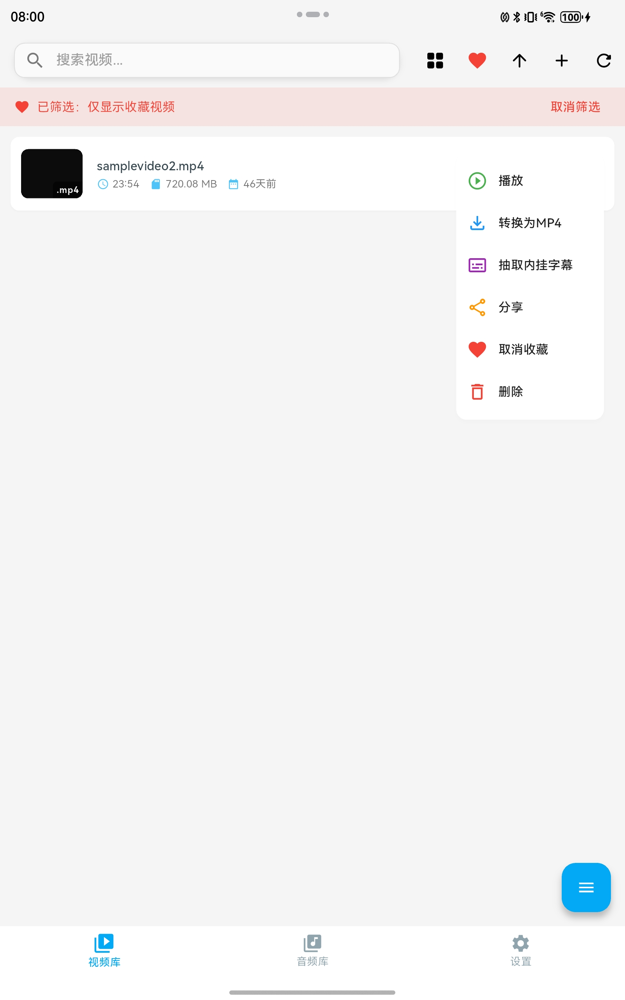

# AloePlayer for HarmonyOS Next

AloePlayer 是一款功能丰富的多媒体播放器，专为 HarmonyOS Next 设计。它支持视频、音频播放，拥有强大的媒体库管理功能，并提供了丰富的设置选项。无论是本地文件还是在线资源，AloePlayer 都能为您提供流畅的播放体验。

[AppGallery下载](https://appgallery.huawei.com/app/detail?id=com.aloereed.aloeplayer)

## 功能特性

- **视频库**：支持续播、显示文件上次修改时间、收藏和筛选收藏视频。
- **音频库**：新增音乐播放器控件，支持自动读取同名LRC文件。
- **设置界面**：改进的设置和WebDAV界面，支持自定义播放体验。
- **直接打开媒体文件**：支持从文件管理器直接打开媒体文件。
- **字幕和弹幕**：支持内挂字幕、字幕轨道切换、加载本地弹幕。
- **缩略图存储**：缩略图存储到应用目录，避免重复获取。
- **播放器控件**：支持后台播放、系统播放控件集成、亮度调节、音量绑定等。

## 截图

## 更新日志

### v2.0.0-beta1
- 界面调整，播放器不再作为单选项卡。
- 打开文件、URL移动到右下角悬浮按钮。
- 优化音频库，新增音乐播放器控件，支持自动读取音频库内同名LRC文件。
- 视频库支持续播。
- 支持缩略图存储到应用目录而非下载文件夹。
- 改进设置、WebDAV界面。
- 视频库支持显示文件上次修改时间。
- 支持收藏和筛选收藏视频。
- 修复其他已知问题。
- 测试版本可能不稳定。

### v1.1.0
- 新增：库内同级文件夹可作为播放列表。
- 改进：可以设置默认库模式为列表模式。
- 改进：视频库缩略图会缓存在下载/AloePlayer下以避免重复获取。
- 改进：兼容API升级为13。

### v1.0.6
- 改进：媒体库长按添加按钮可以新建文件夹。
- 改进：播放控件新增关闭高斯模糊按钮。
- 新增：在设置中可选开始播放时自动全屏。

### v1.0.5
- 改进：媒体库支持文件夹（需从系统文件管理器新建文件夹）。
- 改进：修改了部分UI和动效。
- 新增：解码为系统播放器时可选音轨调整（必须是系统播放器本身能正常播放声音的多声轨文件）。
- 修复：修复了视频库随机性无法加载封面和时长的问题。
- 修复：修复了全屏时返回键退出应用的问题。

### v1.0.4
- 修复：缓解了打开极大文件时闪退的问题。（如仍然闪退，请事先通过系统文件管理器复制入库）。
- 新增：将FFmpeg软解作为默认解码器。使用软解时可能导致卡顿。
- 新增：音频库文件支持音频标签修改器。
- 改进：修改了播放控件UI和部分双击逻辑。

### v1.0.2-beta
- 新增：FFmpeg软解播放。现在可以在正在播放的媒体点击右上角，或长按库中媒体选择FFmpeg播放。目前FFmpeg播放功能较为简陋。

### v1.0.1
- 新增：内挂字幕自动读取、字幕轨道切换。
- 新增：导出库ASS/SRT字幕。
- 新增：转换为MP4。
- 新增：加载本地弹幕。
- 修复了一些已知问题。

### v0.9.9
- 新增：增加编解码器用于提取视频库中视频字幕。
- 修复了字幕、亮度条闪烁的问题。
- 已知问题：全屏上下滑亮度条可能会导致全屏退出。
- 本版本是本测试频道正式版前最后一次更新。

### v0.9.8
- 新增：后台播放、系统播放控件集成。
- 新增：左侧上下滑调节亮度。
- 新增：绑定系统音量。
- 新增：全屏默认横屏。

### v0.9.6
- 新增：视频库、音频库向下载文件夹迁移。现在你可以直接在文件管理中复制到对应文件夹来添加入库。
- 新增：双击视频中间或者在右上角“更多”中的全屏切换来实现带手势的全屏。点击右下角的全屏按钮是不带手势的，但可以在旋转锁定时实现横屏切换。

### v0.9.5
- 修复一些已知问题。
- 修复专辑cover不显示的问题。

### v0.9.4
- 新增：继续尝试修复大文件打开和导入问题。非常大的文件请尝试直接从文件管理打开。
- 新增：鸿蒙风格UI。
- 新增：播放控件UI改变。
- 新增：SRT/ASS（损失布局和风格）/LRC/VTT外挂字幕。
- 新增：应用内旋转锁定切换横竖屏。
- 新增：多选导入至多99个文件。

## 安装与使用

1. 打开AppGallery
2. 在 HarmonyOS Next 设备上搜索AloePlayer。
3. 打开 AloePlayer，开始享受多媒体播放体验。

## 反馈与支持

如果您在使用过程中遇到任何问题或有任何建议，请通过以下方式联系我们：

- **GitHub Issues**: [提交问题](https://github.com/Aloereed/AloePlayer/issues)